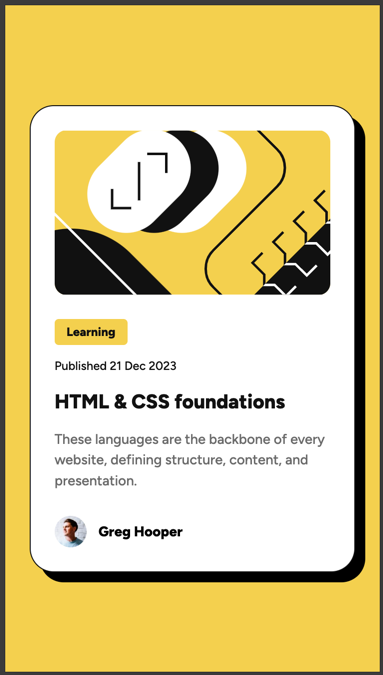
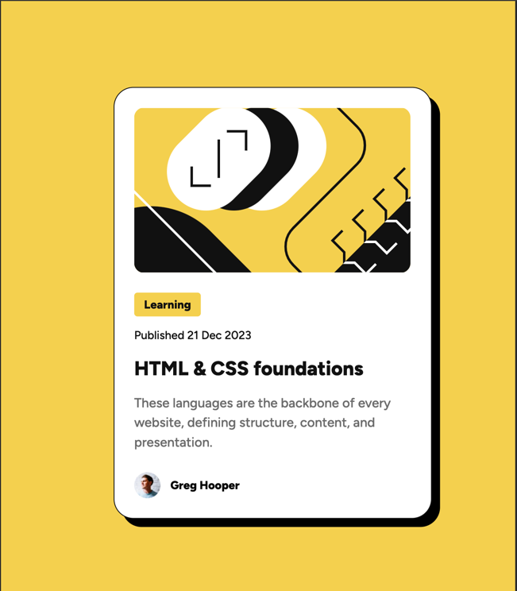
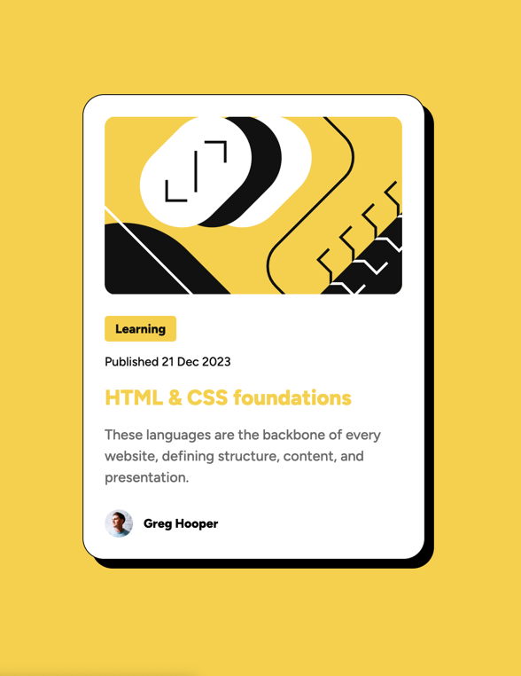

# Frontend Mentor - Blog preview card solution

This is a solution to the [Blog preview card challenge on Frontend Mentor](https://www.frontendmentor.io/challenges/blog-preview-card-ckPaj01IcS). 

## Table of contents

- [Overview](#overview)
  - [The challenge](#the-challenge)
  - [Screenshots](#screenshots)
  - [Links](#links)
- [My process](#my-process)
  - [Built with](#built-with)
  - [What I learned](#what-i-learned)
- [Author](#author)

## Overview

### The challenge

Users should be able to:

- See hover and focus states for all interactive elements on the page

### Screenshots

#### Mobile



#### Desktop and Hover




### Links

- Solution URL: [Github](https://github.com/csmateixeira/blog-preview-card)
- Live Site URL: [Vercel](https://blog-preview-card-orcin-five.vercel.app/)

## My process

### Built with

- Semantic HTML5 markup
- Flexbox
- Mobile-first workflow
- [Tailwindcss](https://tailwindcss.com/) V3

### What I learned

- Make sure the colors match by explicitly specifying them in the tailwind config file.

```json
theme: {
    extend: {
      colors: {
        yellow: "#F4D04E",
        'gray-950': '#111111',
        'gray-500': '#6B6B6B'
      }
    }
}
```
- Make the code cleaner by extracting the tailwind classes to the input css file
- Use semantic HTML tags

## Author

- Frontend Mentor - [@csmateixeira](https://www.frontendmentor.io/profile/csmateixeira)
